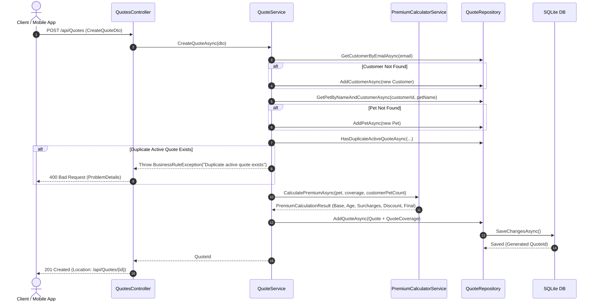
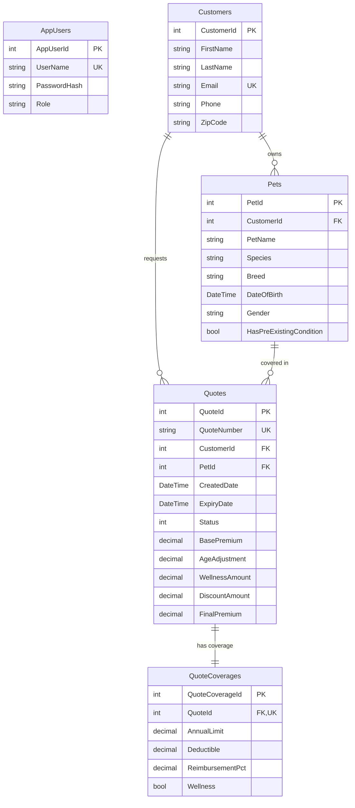

# 🐾 Pet Insurance Quote Management System

[](https://dotnet.microsoft.com/)
[](https://docs.microsoft.com/en-us/ef/core/)
[](https://www.sqlite.org/)
[](https://jwt.io/)
[](#-testing)
[](#-testing)
[](LICENSE)

An enterprise-grade, high-performance ASP.NET Core Web API microservice for managing Pet Insurance Quotes, Pet Registrations, Customer Profiles, Dynamic Risk Premium Calculations, and Excel Batch Import/Export workflows.

---

## 📋 Table of Contents

- [1. Executive Summary](#1-executive-summary)
- [2. System Architecture](#2-system-architecture)
- [3. Tech Stack & Dependencies](#3-tech-stack--dependencies)
- [4. Database Schema & Data Dictionary](#4-database-schema--data-dictionary)
- [5. Getting Started & Installation](#5-getting-started--installation)
- [6. Configuration Reference](#6-configuration-reference)
- [7. Authentication & Security Architecture](#7-authentication--security-architecture)
- [8. Complete API Endpoint Guide](#8-complete-api-endpoint-guide)
- [9. Dynamic Premium Calculation Engine](#9-dynamic-premium-calculation-engine)
- [10. Excel Batch Processing (Import & Export)](#10-excel-batch-processing-import--export)
- [11. Middleware & Exception Handling](#11-middleware--exception-handling)
- [12. Automated Testing Suite](#12-automated-testing-suite)
- [13. Troubleshooting & FAQ](#13-troubleshooting--faq)

---

## 1. Executive Summary

The **Pet Insurance Quote Management System** is designed for modern pet insurance providers requiring scalable, real-time premium pricing, customer-pet relationship management, quote conversion lifecycle tracking, and bulk Excel data processing.

### Core Capabilities
- **Automated Pricing**: Real-time calculation of monthly premiums based on species, age, pre-existing health conditions, multi-pet ownership, and customizable coverages.
- **Quote Lifecycle**: Full state management for insurance quotes (`Active` ➡️ `Converted` / `Expired` / `Cancelled`).
- **Data Deduplication**: Intelligent checks to prevent duplicate active quotes for the same customer-pet-coverage combination.
- **Enterprise Excel Workflows**: Multi-worksheet OpenXML `.xlsx` exports and intelligent header-mapped imports with identity mapping.
- **Interactive OpenAPI/Swagger**: Integrated Scalar UI documentation for API discovery and testing.

---

## 2. System Architecture

The application adheres to **Clean Architecture** principles and the **Repository Pattern**, isolating core domain entities from infrastructure, data access, and API controllers.

### 2.1 Layered Architecture Diagram

```
                              ┌───────────────────────────────┐
                              │    HTTP Clients / Web UI      │
                              └──────────────┬────────────────┘
                                             │ REST API (JSON / Multipart)
                                             ▼
┌───────────────────────────────────────────────────────────────────────────────────────────┐
│ API Layer (PetInsurance)                                                                  │
│  ├── Controllers (AuthController, QuotesController, ExcelController, TestController)      │
│  ├── Middleware (GlobalExceptionMiddleware)                                               │
│  └── Swagger / Scalar UI OpenAPI Generator                                                │
└────────────────────────────────────────────┬──────────────────────────────────────────────┘
                                             │ DTOs / Service Invocations
                                             ▼
┌───────────────────────────────────────────────────────────────────────────────────────────┐
│ Business Logic Layer (Services)                                                           │
│  ├── AuthService (BCrypt Hashing & JWT Generation)                                       │
│  ├── QuoteService (Quote Lifecycle & Orchestration)                                       │
│  ├── PremiumCalculatorService (Risk Multipliers & Discount Engine)                        │
│  └── ExcelService (ClosedXML OpenXML Import/Export Engine)                                │
└────────────────────────────────────────────┬──────────────────────────────────────────────┘
                                             │ Interfaces / Domain Queries
                                             ▼
┌───────────────────────────────────────────────────────────────────────────────────────────┐
│ Data Access Layer (Repositories & EF Core)                                                │
│  ├── GenericRepository<T> & Entity Repositories (IQuoteRepository, IUserRepository, etc.) │
│  ├── AppDbContext (SQLite EF Core Context)                                                │
│  └── DbInitializer (Automatic Database Seeding & Schema Migrations)                        │
└────────────────────────────────────────────┬──────────────────────────────────────────────┘
                                             │ LINQ / SQL Commands
                                             ▼
                               ┌───────────────────────────┐
                               │ SQLite Relational DB      │
                               │ (petinsurance.db)         │
                               └───────────────────────────┘
```

### 2.2 Sequence Diagram: Quote Creation & Calculation Flow



---

## 3. Tech Stack & Dependencies

| Category | Technology | Version | Purpose |
|---|---|---|---|
| **Runtime** | .NET | 10.0 | High-performance cross-platform runtime |
| **Framework** | ASP.NET Core Web API | 10.0 | REST API layer and middleware pipeline |
| **ORM** | Entity Framework Core | 10.0 | Object-Relational Mapping & LINQ execution |
| **Database** | SQLite | 3.x | Lightweight, zero-config relational store |
| **Authentication** | JwtBearer | 10.0 | Claims-based JWT authorization |
| **Password Hashing** | BCrypt.Net-Next | 4.0.3 | Industry-standard password hashing algorithm |
| **Excel Handling** | ClosedXML | 0.104.2 | High-performance OpenXML spreadsheet engine |
| **API Docs** | Scalar.AspNetCore | 2.0.36 | Interactive, modern OpenAPI web client |
| **Unit Testing** | NUnit | 4.3.2 | Test runner framework |
| **Mocking** | Moq | 4.20.72 | Mock object generation for unit testing |
| **Assertions** | FluentAssertions | 8.0.1 | Fluent assertion syntax for test readability |

---

## 4. Database Schema & Data Dictionary

The database consists of 5 core entities managed via EF Core. Below is the Entity Relationship Diagram (ERD) followed by complete table field specifications.

### 4.1 Entity Relationship Diagram (ERD)



### 4.2 Field Specifications

#### `Customers` Table
| Column Name | Data Type | Nullable | Constraints | Description |
|---|---|---|---|---|
| `CustomerId` | `INTEGER` | No | Primary Key, Auto-Increment | Unique Customer Identifier |
| `FirstName` | `TEXT` | No | Max Length 50 | Customer First Name |
| `LastName` | `TEXT` | No | Max Length 50 | Customer Last Name |
| `Email` | `TEXT` | No | Unique Index, Max 100 | Customer Email Address |
| `Phone` | `TEXT` | No | Max 20 | Contact Phone Number |
| `ZipCode` | `TEXT` | No | Max 10 | Postal Zip Code |

#### `Pets` Table
| Column Name | Data Type | Nullable | Constraints | Description |
|---|---|---|---|---|
| `PetId` | `INTEGER` | No | Primary Key, Auto-Increment | Unique Pet Identifier |
| `CustomerId` | `INTEGER` | No | Foreign Key (`Customers.CustomerId`) | Owner Reference |
| `PetName` | `TEXT` | No | Max Length 50 | Name of the Pet |
| `Species` | `TEXT` | No | Dog / Cat | Species Classification |
| `Breed` | `TEXT` | No | Max Length 50 | Breed Name |
| `DateOfBirth` | `TEXT` | No | ISO Date | Birth Date for Age Calculation |
| `Gender` | `TEXT` | No | Male / Female / Unknown | Pet Gender |
| `HasPreExistingCondition` | `INTEGER` | No | Boolean (0/1) | Pre-existing Illness Flag |

#### `Quotes` Table
| Column Name | Data Type | Nullable | Constraints | Description |
|---|---|---|---|---|
| `QuoteId` | `INTEGER` | No | Primary Key, Auto-Increment | Unique Quote Identifier |
| `QuoteNumber` | `TEXT` | No | Unique Index, Max 20 | Format: `QT-XXXXXXXX` |
| `CustomerId` | `INTEGER` | No | Foreign Key (`Customers.CustomerId`) | Customer Reference |
| `PetId` | `INTEGER` | No | Foreign Key (`Pets.PetId`) | Insured Pet Reference |
| `CreatedDate` | `TEXT` | No | ISO DateTime | Quote Generation Timestamp |
| `ExpiryDate` | `TEXT` | No | ISO DateTime | Quote Expiration Timestamp (+30 Days) |
| `Status` | `INTEGER` | No | Enum (0=Active, 1=Converted, 2=Expired, 3=Cancelled) | Status Code |
| `BasePremium` | `NUMERIC` | No | Decimal (18,2) | Base Pricing by Species |
| `AgeAdjustment` | `NUMERIC` | No | Decimal (18,2) | Age Risk Factor Amount |
| `WellnessAmount` | `NUMERIC` | No | Decimal (18,2) | Wellness Add-on Pricing |
| `DiscountAmount` | `NUMERIC` | No | Decimal (18,2) | Multi-Pet Discount Subtraction |
| `FinalPremium` | `NUMERIC` | No | Decimal (18,2) | Total Monthly Premium Payable |

#### `QuoteCoverages` Table
| Column Name | Data Type | Nullable | Constraints | Description |
|---|---|---|---|---|
| `QuoteCoverageId` | `INTEGER` | No | Primary Key, Auto-Increment | Unique Coverage Identifier |
| `QuoteId` | `INTEGER` | No | Foreign Key (`Quotes.QuoteId`), Unique | 1-to-1 Quote Reference |
| `AnnualLimit` | `NUMERIC` | No | Decimal (18,2) | Max Annual Payout (e.g. 5000) |
| `Deductible` | `NUMERIC` | No | Decimal (18,2) | Annual Out-of-pocket (e.g. 250) |
| `ReimbursementPct` | `NUMERIC` | No | Decimal (5,2) | Payout Percentage (0.70, 0.80, 0.90) |
| `Wellness` | `INTEGER` | No | Boolean (0/1) | Optional Wellness Option Flag |

---

## 5. Getting Started & Installation

### Prerequisites
- **.NET 10 SDK** or later installed.
- **Node.js v18+** & **npm v9+** for Angular UI.
- PowerShell or Terminal environment.

### Setup Instructions

#### 1. Backend ASP.NET Core API Setup (`http://localhost:5294`)

1. Navigate to the backend directory:
   ```bash
   cd d:\Dotnet\PetInsurancePOC\PetInsurance
   ```

2. Restore dependencies & build solution:
   ```bash
   dotnet restore
   dotnet build
   ```

3. Run the backend API:
   ```bash
   dotnet run
   ```

4. Interactive Swagger / OpenAPI Documentation:
   - Access Swagger UI at **`http://localhost:5294/swagger`**

---

#### 2. Frontend Angular UI Setup (`http://localhost:4200`)

1. Open a new terminal and navigate to the frontend directory:
   ```bash
   cd d:\Dotnet\frontend\PetInsurance-UI
   ```

2. Install npm dependencies:
   ```bash
   npm install
   ```

3. Start the Angular dev server:
   ```bash
   npm start
   ```

4. Access the Web Application in your browser:
   - Navigate to **`http://localhost:4200`**
   - Log in using default admin credentials:
     - **Username**: `admin`
     - **Password**: `Password123!`

---

## 6. Configuration Reference

Configuration parameters are stored in `PetInsurance/appsettings.json`:

```json
{
  "Logging": {
    "LogLevel": {
      "Default": "Information",
      "Microsoft.AspNetCore": "Warning"
    }
  },
  "ConnectionStrings": {
    "DefaultConnection": "Data Source=petinsurance.db"
  },
  "Jwt": {
    "Key": "SuperSecretKeyForJwtTokenGenerationMustBeLongerThan32Bytes!",
    "Issuer": "PetInsuranceAPI",
    "Audience": "PetInsuranceUsers",
    "ExpiryInMinutes": 60
  },
  "PremiumSettings": {
    "DogBasePremium": 30.00,
    "CatBasePremium": 20.00,
    "AgeMultiplierPerYear": 0.05,
    "PreExistingConditionSurcharge": 15.00,
    "MultiPetDiscountPercentage": 10.00,
    "WellnessAddonCost": 15.00
  }
}
```

---

## 7. Authentication & Security Architecture

Secure endpoints are protected via **JWT (JSON Web Token) Bearer Authorization**.

### Auth Flow Diagram

```
Client ──► POST /api/Auth/login ──► Server validates BCrypt Password ──► Returns JWT Token
Client ──► Request + Header "Authorization: Bearer <Token>" ──► Server validates Claims ──► Grants Access
```

### Seeded Admin User
- **Username**: `admin`
- **Password**: `Password123!`
- **Role**: `Admin`

---

## 8. Complete API Endpoint Guide

### 8.1 Authentication Endpoints (`/api/Auth`)

#### 1. Login User
- **Method**: `POST`
- **Endpoint**: `/api/Auth/login`
- **Auth**: None (Public)
- **Request Body**:
  ```json
  {
    "userName": "admin",
    "password": "Password123!"
  }
  ```
- **Response (200 OK)**:
  ```json
  {
    "token": "eyJhbGciOiJIUzI1NiIsInR5cCI6IkpXVCJ9...",
    "userName": "admin",
    "role": "Admin",
    "expiresAt": "2026-10-04T09:45:00Z"
  }
  ```

#### 2. Register User
- **Method**: `POST`
- **Endpoint**: `/api/Auth/register`
- **Auth**: None (Public)
- **Request Body**:
  ```json
  {
    "userName": "john_agent",
    "password": "SecurePassword123!"
  }
  ```
- **Response (200 OK)**: `"User registered successfully."`

---

### 8.2 Quotes Endpoints (`/api/Quotes`)

#### 1. Create Quote
- **Method**: `POST`
- **Endpoint**: `/api/Quotes`
- **Auth**: Bearer Token Required
- **Request Body**:
  ```json
  {
    "firstName": "Sanjay",
    "lastName": "Kumar",
    "email": "sanjay@example.com",
    "phone": "9876543210",
    "zipCode": "560001",
    "petName": "Rover",
    "species": "Dog",
    "breed": "Labrador",
    "dateOfBirth": "2021-06-15",
    "gender": "Male",
    "hasPreExistingCondition": false,
    "annualLimit": 5000,
    "deductible": 250,
    "reimbursementPct": 0.80,
    "wellness": true
  }
  ```
- **Response (201 Created)**:
  ```json
  {
    "quoteId": 12
  }
  ```

#### 2. Search & Paginate Quotes
- **Method**: `GET`
- **Endpoint**: `/api/Quotes?searchQuery=Sanjay&species=Dog&status=Active&pageNumber=1&pageSize=10`
- **Auth**: Bearer Token Required
- **Response (200 OK)**:
  ```json
  {
    "items": [
      {
        "quoteId": 12,
        "quoteNumber": "QT-981A7B2C",
        "customerName": "Sanjay Kumar",
        "customerEmail": "sanjay@example.com",
        "petName": "Rover",
        "species": "Dog",
        "breed": "Labrador",
        "status": "Active",
        "finalPremium": 52.50,
        "createdDate": "2026-10-04T08:00:00Z",
        "expiryDate": "2026-11-03T08:00:00Z"
      }
    ],
    "totalCount": 1,
    "pageNumber": 1,
    "pageSize": 10,
    "totalPages": 1
  }
  ```

#### 3. Get Dashboard Metrics
- **Method**: `GET`
- **Endpoint**: `/api/Quotes/dashboard`
- **Auth**: Bearer Token Required
- **Response (200 OK)**:
  ```json
  {
    "totalQuotes": 45,
    "activeQuotes": 30,
    "convertedQuotes": 12,
    "expiredQuotes": 2,
    "cancelledQuotes": 1,
    "averagePremium": 48.75,
    "quotesByStatus": {
      "Active": 30,
      "Converted": 12,
      "Expired": 2,
      "Cancelled": 1
    }
  }
  ```

#### 4. Convert Quote to Policy
- **Method**: `POST`
- **Endpoint**: `/api/Quotes/12/convert`
- **Auth**: Bearer Token Required
- **Response (200 OK)**: `"Quote converted successfully."`

---

### 8.3 Excel Endpoints (`/api/Excel`)

#### 1. Export Quotes to Excel
- **Method**: `GET`
- **Endpoint**: `/api/Excel/quotes/export`
- **Auth**: Bearer Token Required
- **Response Header**: `Content-Type: application/vnd.openxmlformats-officedocument.spreadsheetml.sheet`
- **Response Body**: Binary stream of formatted `.xlsx` workbook containing 4 worksheets.

#### 2. Import Quotes from Excel
- **Method**: `POST`
- **Endpoint**: `/api/Excel/quotes/import`
- **Auth**: Bearer Token Required
- **Payload**: `multipart/form-data` with `file` parameter (.xlsx).
- **Response (200 OK)**:
  ```json
  {
    "message": "Import completed successfully.",
    "importedQuotes": 5,
    "importedCustomers": 2,
    "importedPets": 3
  }
  ```

---

## 9. Dynamic Premium Calculation Engine

The premium engine computes exact risk-adjusted monthly premiums:

$$\text{Final Premium} = \text{Base Premium} + \text{Age Adjustment} + \text{Pre-Existing Surcharge} + \text{Wellness Amount} - \text{Multi-Pet Discount}$$

### Step-by-Step Calculation Breakdown

1. **Base Premium**:
   - Dog = **\$30.00**
   - Cat = **\$20.00**
2. **Age Factor**:
   - $\text{Age} = \lfloor \text{Years between DateOfBirth and Today} \rfloor$
   - $\text{Age Adjustment} = \text{Base Premium} \times (\text{Age} \times 0.05)$
3. **Pre-Existing Health Condition**:
   - If `HasPreExistingCondition == true` ➡️ Add flat **\$15.00** surcharge.
4. **Wellness Optional Add-on**:
   - If `Wellness == true` ➡️ Add flat **\$15.00** monthly add-on cost.
5. **Multi-Pet Discount**:
   - If customer owns $\ge 2$ pets ➡️ Subtract flat **\$10.00** discount.

#### Sample Calculation Table
| Species | Age | Pre-Existing? | Wellness? | Pets Count | Base | Age Adj | Health | Wellness | Discount | Final Premium |
|---|---|---|---|---|---|---|---|---|---|---|
| **Dog** | 4 yrs | No | Yes | 1 | \$30.00 | \$6.00 | \$0.00 | \$15.00 | \$0.00 | **\$51.00** |
| **Cat** | 2 yrs | Yes | No | 2 | \$20.00 | \$2.00 | \$15.00 | \$0.00 | \$10.00 | **\$27.00** |

---

## 10. Excel Batch Processing (Import & Export)

The system features robust OpenXML processing via ClosedXML.

### Exported Excel Structure

```
PetInsuranceExport.xlsx
├── 📄 Customers Sheet      (CustomerId, FirstName, LastName, Email, Phone, ZipCode)
├── 📄 Pets Sheet           (PetId, CustomerId, PetName, Species, Breed, DateOfBirth, Gender, HasPreExistingCondition)
├── 📄 Quotes Sheet         (Master View: Quote Info, Customer Info, Pet Info, Premium Breakdown, Coverage)
└── 📄 QuoteCoverages Sheet (QuoteCoverageId, QuoteId, AnnualLimit, Deductible, ReimbursementPct, Wellness)
```

- **Styling**: Navy Headers (`#1F4E78`), bold white text, auto-adjusted column widths.
- **Formatting**: Currency formatting (`$#,##0.00`), percentage formatting (`0%`), ISO Date formatting (`yyyy-MM-dd`).

---

## 11. Middleware & Exception Handling

The API employs a centralized `GlobalExceptionMiddleware` that converts application exceptions into standardized **RFC 7807 ProblemDetails** JSON responses:

```json
{
  "type": "https://tools.ietf.org/html/rfc7231#section-6.5.1",
  "title": "Business Rule Error",
  "status": 400,
  "detail": "An active quote already exists for this customer and pet with identical coverage parameters."
}
```

---

## 12. Automated Testing Suite

The project includes an NUnit & Moq test suite with **100% pass rate (21 Passing Tests)**:

```bash
dotnet test
```

### Test Suite Summary
- **`AuthServiceTests`**: 3 tests covering registration, valid login, and invalid password cases.
- **`QuoteServiceTests`**: 8 tests covering quote creation, duplicate prevention, conversion, recalculation, and status updates.
- **`PremiumCalculatorServiceTests`**: 4 tests verifying Dog/Cat base rates, age scaling, pre-existing surcharges, and multi-pet discount subtractions.
- **`QuoteRepositoryLinqTests`**: 3 tests executing complex EF Core LINQ queries, dashboard metrics, and pagination.
- **`QuotesControllerTests`**: 1 test verifying HTTP status code mappings.
- **`ExcelServiceTests`**: 2 tests validating multi-worksheet `.xlsx` generation, stream byte serialization, and roundtrip data import integrity.

---

## 13. Troubleshooting & FAQ

### 1. Build fails with `The process cannot access the file because it is being used by another process`
**Solution**: An instance of `PetInsurance.exe` is running in the background. Kill the process using PowerShell:
```powershell
Stop-Process -Name "PetInsurance" -Force -ErrorAction SilentlyContinue
dotnet build
```

### 2. HTTP 401 Unauthorized on Excel Export
**Solution**: Ensure you include the JWT Bearer token in your request header:
```bash
curl -X 'GET' \
  'http://localhost:5294/api/Excel/quotes/export' \
  -H 'Authorization: Bearer <YOUR_JWT_TOKEN>'
```

---

© 2026 Pet Insurance POC Team. Built with .NET 10.0 and ASP.NET Core.
